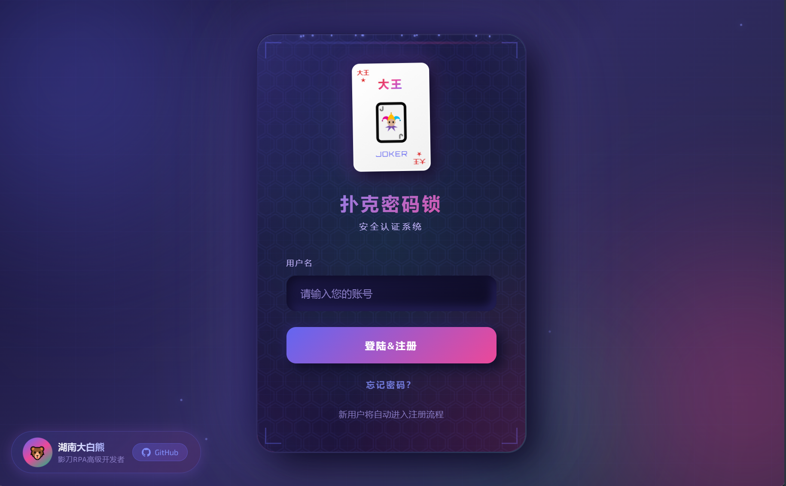
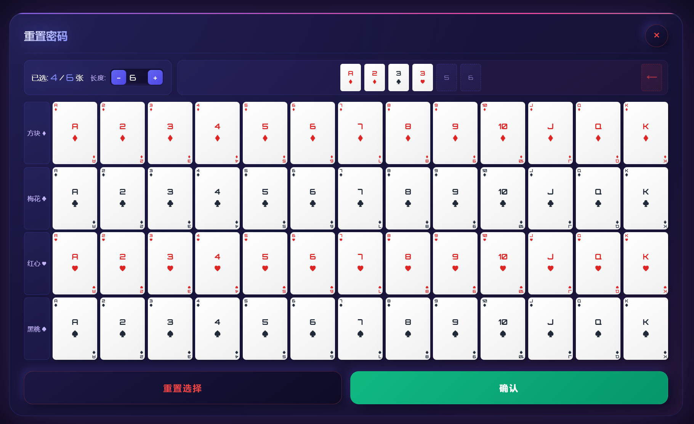
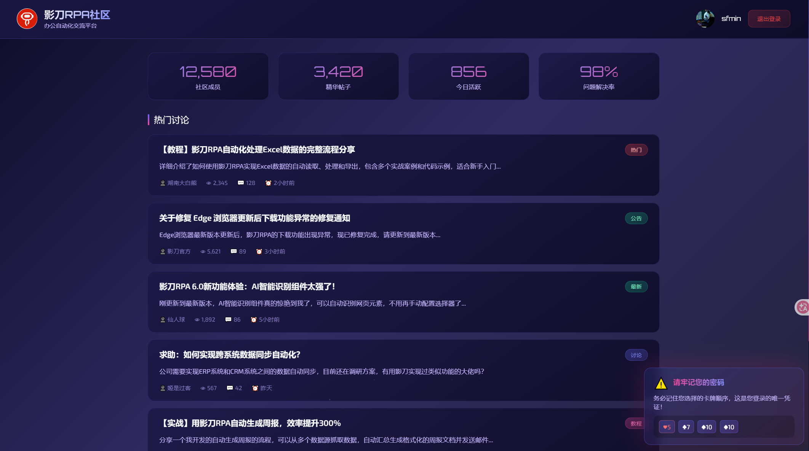

# 🃏 扑克密码锁 - Card Password Login
### *我要验牌~  牌没有问题~  给我擦皮鞋~*
---

Poker Cipher Lock - A cool password authentication system using playing cards, so creative! Let me verify the cards~
一个炫酷的扑克牌密码认证系统，将传统密码输入方式转化为有趣的扑克牌选择游戏。
开源地址：[https://github.com/HnBigVolibear/card-password-login](https://github.com/HnBigVolibear/card-password-login)

> 仅DEMO展示，故采用单文件HTML方式！！！

## ✨ 功能特性

### 🔐 创新密码系统
- 使用扑克牌组合作为密码，告别传统字符密码
- 支持3-15张牌的密码长度自定义
- 直观的卡牌选择界面，操作简单
- 花色行位置每次随机摆放，增加安全性

### 🎨 炫酷视觉效果
- **赛博朋克风格UI** - 深色主题配合霓虹发光效果
- **双卡牌动画** - 登录界面展示大小王叠加浮动动画
- **自定义鼠标光标** - 发光圆形光标配合星星轨迹特效
- **动态粒子背景** - 漂浮粒子营造科技氛围
- **流畅动画过渡** - 所有交互都有精心设计的动画效果
- **按钮悬停特效** - 登录按钮悬停时发光脉冲动画

### 🔔 智能提醒系统
- **密码设置提醒** - 设置/重置密码后弹出提醒框，展示所选卡牌
- **登录成功提示** - 显示"牌没有问题"炫酷大字
- **自动消失动画** - 提醒框5秒后自动淡出

### 📱 用户系统（Demo测试）
- 新用户自动注册
- 密码重置功能（重置后返回登录页重新验证）
- 本地存储用户数据

### 🏠 社区功能（Demo测试）
- 登录后进入社区页面
- 帖子浏览与分页
- 用户信息展示

### 👤 作者信息展示
- 左下角展示作者简介
- 右上角显示用户头像
- GitHub链接一键跳转

## 📸 系统截图

### 登录界面

*炫酷的登录界面，带有大小王双卡牌叠加动画和发光效果*

### 密码选择界面

*点击登录后进入扑克牌选择界面，选择你的密码牌组*

### 社区页面

*登录成功后进入社区，浏览帖子内容*

## 🚀 快速开始

### 在线预览
直接在浏览器中打开 `index.html` 文件即可运行。

### 本地运行
```bash
# 克隆仓库
git clone https://github.com/HnBigVolibear/card-password-login.git

# 进入项目目录
cd card-password-login

# 使用Python启动本地服务器
python -m http.server 8080
# 然后在浏览器中访问 http://localhost:8080

# 或者直接浏览器打开html文件即可！
```

## 🎮 使用说明

1. **登录/注册**
   - 输入用户名
   - 点击"我要验牌~"按钮
   - 新用户将自动进入注册流程

2. **设置密码**
   - 在扑克牌界面选择你的密码牌组
   - 可以调整密码长度（3-15张牌）
   - 点击确认完成设置
   - 右下角会弹出提醒，请务必记住所选卡牌！

3. **登录验证**
   - 再次登录时，选择之前设置的扑克牌组合
   - 选择正确即可进入社区
   - 成功后显示"牌没有问题"提示

4. **重置密码**
   - 点击"忘记密码？"
   - 重新选择新的密码牌组
   - 重置成功后返回登录页重新验证

## 🛠️ 技术栈

- **HTML5** - 页面结构
- **CSS3** - 样式与动画
  - CSS Variables 主题变量
  - CSS Animations 动画效果
  - Flexbox/Grid 布局
  - Backdrop-filter 毛玻璃效果
- **JavaScript** - 交互逻辑
  - LocalStorage 数据存储
  - DOM 操作
  - 事件处理
  - 动态粒子生成

## 📁 项目结构

```
card-password-login/
├── index.html          # 主页面（包含HTML/CSS/JS）
├── README.md           # 项目说明文档
└── screenshots/        # 截图目录
    ├── 1.png           # 登录界面
    ├── 2.png           # 密码选择界面
    └── 3.png           # 社区页面
```

## 🎨 自定义主题

项目使用CSS变量管理主题颜色，你可以在 `index.html` 的 `:root` 中修改：

```css
:root {
    --primary: #6366f1;        /* 主色调 */
    --secondary: #ec4899;      /* 次要色调 */
    --accent: #10b981;         /* 强调色 */
    --bg-main: #1e1b4b;        /* 背景色 */
    /* ... 更多变量 */
}
```

## 👤 作者

**湖南大白熊**
- 影刀RPA高级开发者
- GitHub: [HnBigVolibear](https://github.com/HnBigVolibear)

## 📄 许可证

本项目采用 MIT 许可证 - 详见 [LICENSE](LICENSE) 文件

## 🙏 致谢

- 字体: [Orbitron](https://fonts.google.com/specimen/Orbitron) & [Exo 2](https://fonts.google.com/specimen/Exo+2)
- 灵感来源: 赛博朋克风格设计

---

⭐ 如果这个项目对你有帮助，欢迎给个 Star！

## Sponsor Me 捐赠我：

